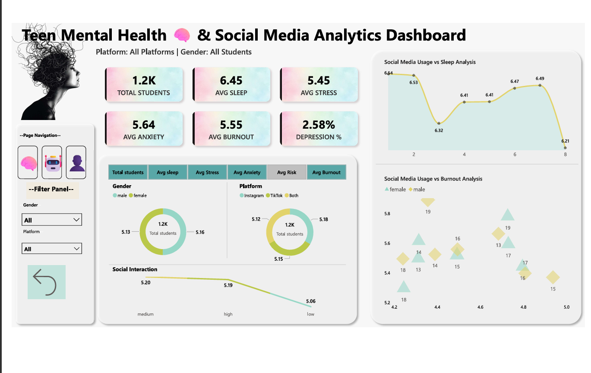
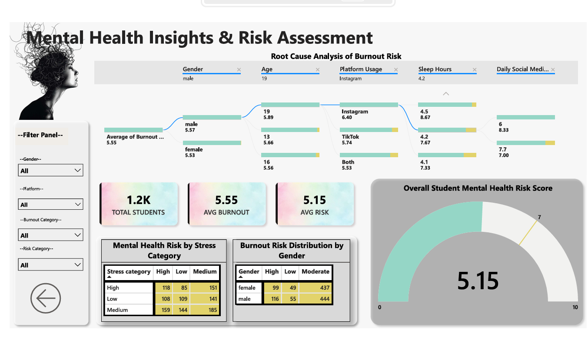
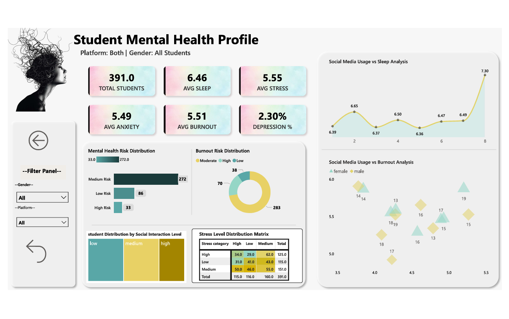
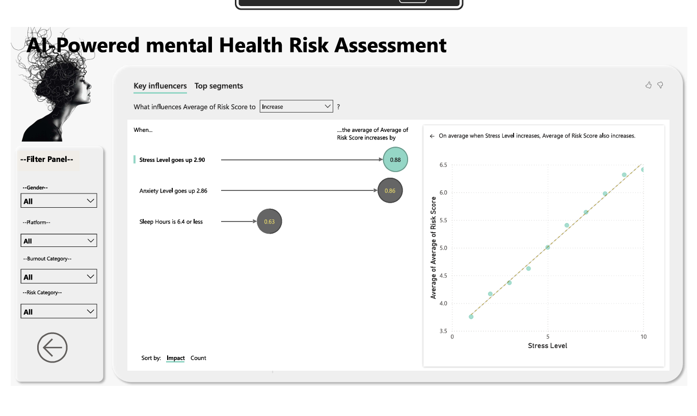

# 🧠 Teen Mental Health Risk Assessment Dashboard

> An end-to-end Power BI project analyzing the relationship between social media usage, stress, anxiety, sleep, burnout, and overall mental health risk among students.

---

# Dashboard Preview

## Main Dashboard



---

## Mental Health Insights



---

## Student Profile



---

## AI Powered Key Influencers



---

# Project Overview

Mental health has become one of the biggest concerns among teenagers due to increasing academic pressure and excessive social media usage.

This project aims to identify:

- Factors affecting mental health
- Burnout drivers
- High-risk student groups
- Relationship between sleep and stress
- Platform-wise behavioral differences
- AI-driven factors influencing mental health risk

The dashboard provides interactive insights to support educators, parents, and decision-makers.

---

# Business Problem

Educational institutions often struggle to identify students at risk before serious mental health issues develop.

This dashboard helps answer questions such as:

- Which students are at highest risk?
- How does stress affect burnout?
- Which social media platform is associated with higher anxiety?
- Does poor sleep increase mental health risk?
- Which factors have the strongest influence on risk scores?

---

# Objectives

✔ Analyze student mental health

✔ Identify burnout trends

✔ Compare stress across demographics

✔ Study social media impact

✔ Discover key risk drivers using AI

✔ Build an interactive decision-support dashboard

---

# Dataset Information

Source: Public Dataset

Records:
- 1,200 Students

Features include:

- Age
- Gender
- Platform Usage
- Daily Social Media Hours
- Sleep Hours
- Stress Level
- Anxiety Level
- Burnout Score
- Risk Score
- Depression Indicator
- Social Interaction Level

---

# Dashboard Pages

## 1️⃣ Teen Mental Health Dashboard

KPIs

- Total Students
- Average Sleep
- Average Stress
- Average Anxiety
- Average Burnout
- Depression %

Visuals

- KPI Cards
- Donut Charts
- Line Chart
- Scatter Plot
- Navigation Buttons

---

## 2️⃣ Mental Health Insights

Features

- Decomposition Tree
- Gauge Chart
- Student Distribution Tables
- Burnout Analysis
- Risk Distribution
- Root Cause Analysis

---

## 3️⃣ Student Profile

Interactive student-level analysis including

- Risk Distribution
- Burnout Distribution
- Social Interaction
- Stress Matrix
- Individual KPIs

---

## 4️⃣ AI Powered Risk Assessment

Power BI AI Visuals

- Key Influencers
- Average Risk Drivers
- AI Insights
- Risk Prediction Trends

---

# Key Insights

### Stress

Higher stress levels significantly increase mental health risk.

---

### Anxiety

Students with elevated anxiety levels tend to experience higher burnout scores.

---

### Sleep

Students sleeping fewer than 6.5 hours show noticeably higher risk scores.

---

### Social Media

Heavy social media usage is associated with increased stress and burnout.

---

### Burnout

Burnout is strongly correlated with overall mental health risk.

---

# Power BI Features Used

- Power Query
- Data Cleaning
- Data Modeling
- Relationships
- DAX Measures
- KPI Cards
- Gauge Chart
- Donut Charts
- Scatter Plot
- Line Charts
- Matrix
- Decomposition Tree
- AI Key Influencers
- Navigation Buttons
- Slicers
- Conditional Formatting

---

# DAX Measures

Examples include

- Total Students
- Average Stress
- Average Sleep
- Average Anxiety
- Average Burnout
- Average Risk Score
- Depression %
- Student Count
- Risk Categories

---

# Tools & Technologies

- Power BI Desktop
- DAX
- Power Query
- Excel / CSV
- Data Modeling
- AI Visuals

---

# Business Value

This dashboard helps educational institutions

- Identify high-risk students
- Understand burnout patterns
- Improve intervention strategies
- Promote healthier digital habits
- Support evidence-based mental health initiatives

---

# Project Files

```
Assets/
Teen_Mental_Health_Dataset.csv/
Teen_Mental.pbix/
README.md
LICENSE
```

---

# Future Improvements

- Predictive Machine Learning
- Azure SQL Integration
- Real-time Dashboard
- Power BI Service Deployment
- Row-Level Security
- Mobile Layout

---

# Author

### Anusree M A

Data Analyst

Skills

- Power BI
- Tableau
- SQL
- Excel
- DAX
- Power Query

LinkedIn:
linkedin.com/in/anusree-ma

GitHub:
https://github.com/Anusree-MA

---

If you found this project useful, consider giving it a ⭐.
